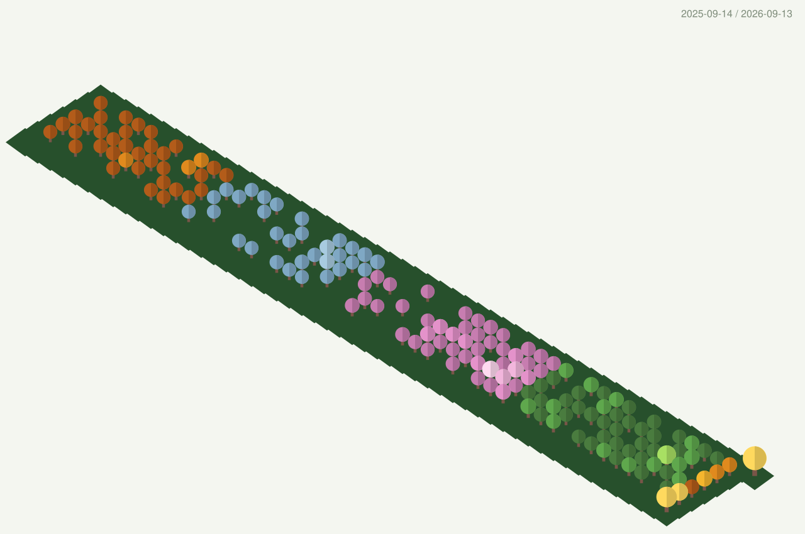
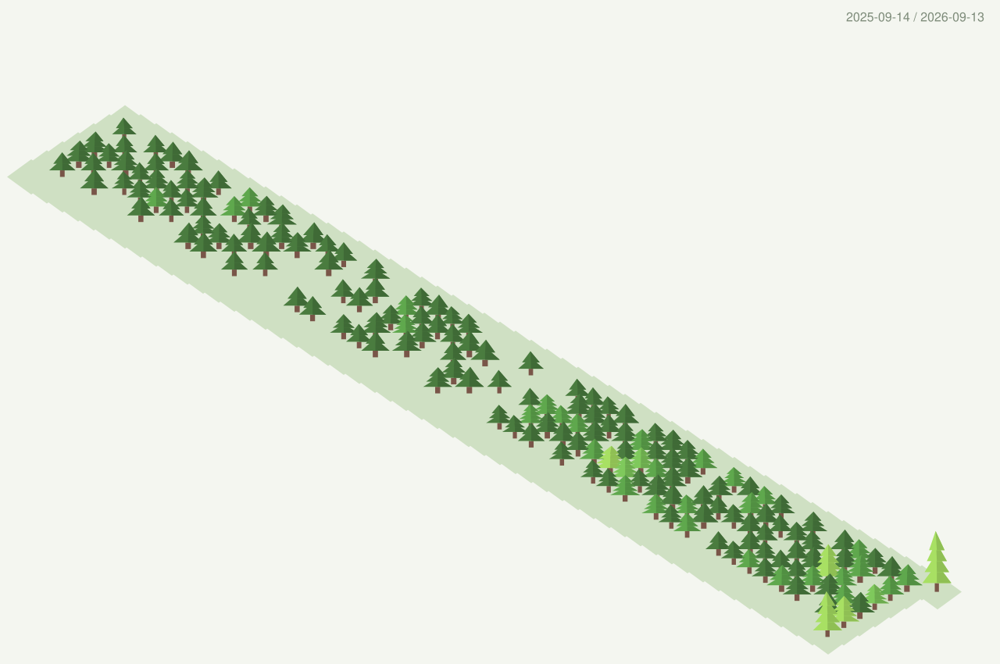
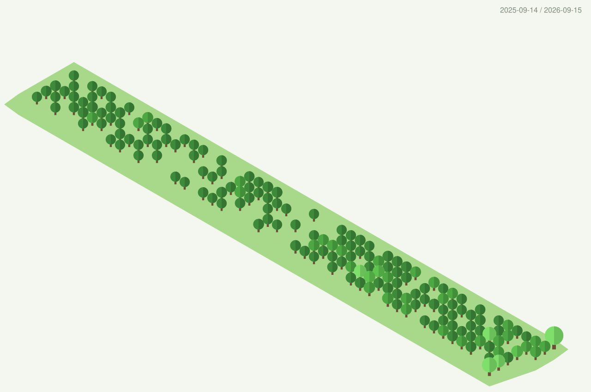
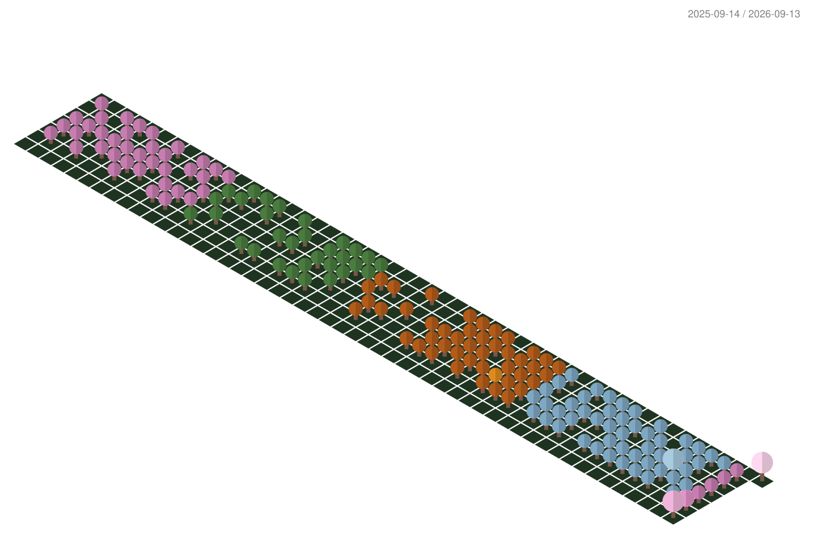

<h1 align="center">Hi, I'm Isabel 🤠</h1>

  Software engineer · Full-stack developer with an interest in UI/UX and learning new things :)

---

### 🛠️ Tech Stack

**Languages**

  
  
  
  

**Frameworks**

  
  
  
  
  

**Data &amp; Infrastructure**

  
  
  
  
  
  

---

### 📊 GitHub Stats

  

---

### 🌲 My contributions as a 3D forest :D

  

Other versions

**Pine forest**

  

**Round crowns**

  

**Seasons, southern hemisphere**

  

  Grown with <a href="https://github.com/isabelcan7/github-profile-3d-contrib">my fork</a> of <a href="https://github.com/yoshi389111/github-profile-3d-contrib">github-profile-3d-contrib</a> — added tree shapes and seasonal forests.

